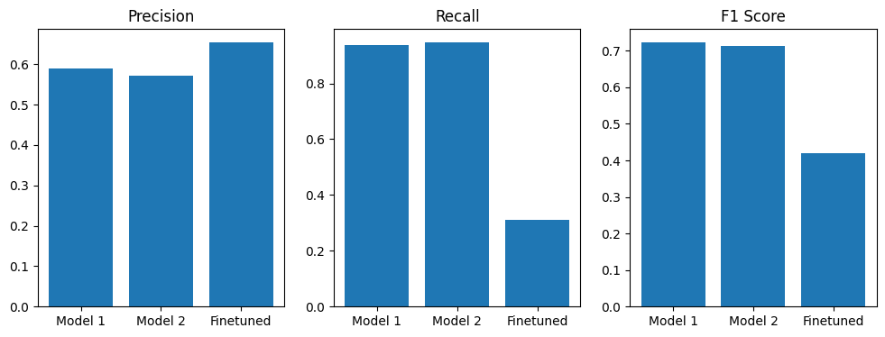
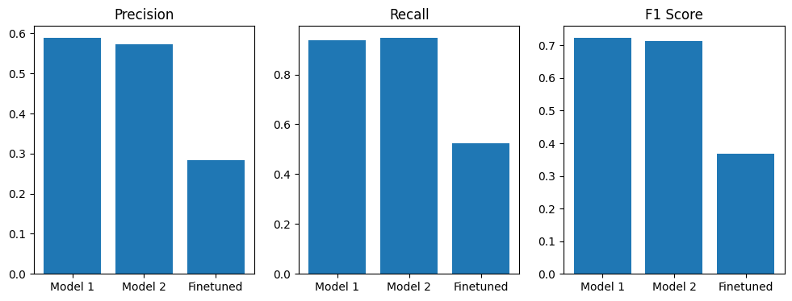
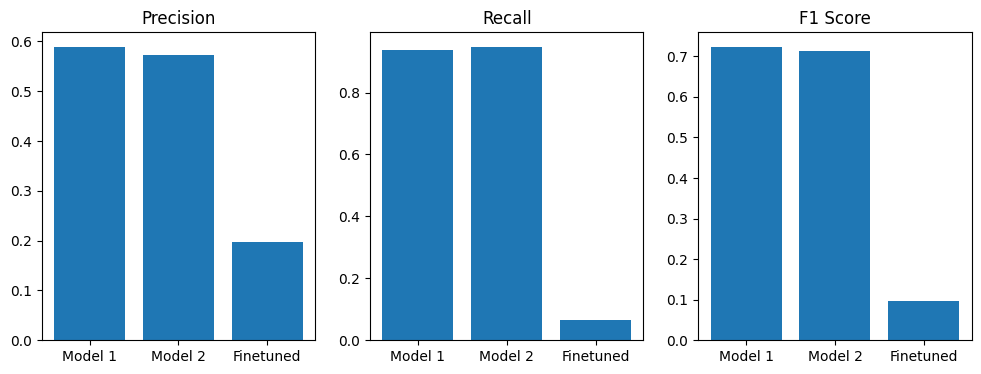

# Animal Detection in Real-Time Video Using Detectron2 Models

## Introduction and Project Overview

This project is an immersive journey into the realm of machine learning and object detection, focusing on the real-time identification and classification of animals in video footage. Our dataset includes five animal classes: Crocodile, Fox, Giraffe, Panda, and Raccoon, each represented by 100 images. The aim is to leverage the capabilities of Detectron2, a leading object detection library from Facebook AI Research, to evaluate the effectiveness of different models in wildlife monitoring and conservation.

### Objective

Our goal is to deploy three distinct object detection models to identify and classify animals in a live video setting. The project emphasizes the potential of AI in wildlife monitoring, aiming to optimize model accuracy with a balanced dataset of 500 annotated images.

### Models and Approach

1. **Model Selection**: 
   - **Faster R-CNN R 50 DC5 3x**: Chosen for its proficiency in capturing fine details, crucial for detecting small or camouflaged animals.
   - **Faster R-CNN R 50 FPN 3x**: Selected for its capability to handle scale variability, essential for identifying animals of various sizes.

2. **Model Finetuning**: 
   - We finetune the Faster R-CNN R 50 FPN 3x model on our custom dataset, adjusting the final layer to accommodate our five animal classes.

3. **Real-Time Evaluation**: 
   - The models are evaluated in a real-time setting, processing a video that includes instances of our target animals. Performance is assessed based on accuracy and processing speed.

## The Contest

- **Setup**: Three videos shown side-by-side, each analyzed by a different model.
- **Function**: Real-time detection with models drawing bounding boxes, confidence percentages, and class labels.
- **Objective**: To visually compare the performances of the models in identifying and classifying animals.

## Results

We conducted a comprehensive evaluation of three different finetuned models on our dataset, focusing on metrics like Precision, Recall, and F1 Score. The results were as follows:

- **Model 1 (pretrained)**:
  - Precision: 0.5888
  - Recall: 0.9360
  - F1 Score: 0.7229

- **Model 2 (pretrained)**:
  - Precision: 0.5718
  - Recall: 0.9471
  - F1 Score: 0.7131

- **Finetuned Model (5000 max iter, 0.2 threshold)**:
  - Precision: 0.6540
  - Recall: 0.3102
  - F1 Score: 0.4208
 

- **Finetuned Model (10000 max iter, 0.2 threshold)**:
  - Precision: 0.2519
  - Recall: 0.2726
  - F1 Score: 0.2619

- **Finetuned Model (10000 max iter, 0.5 threshold)**:
  - Precision: 0.1966
  - Recall: 0.0640
  - F1 Score: 0.0965

### Conclusion

The comparison suggests that Model 1 and Model 2 exhibit higher recall rates, indicating their effectiveness in detecting relevant objects. However, they also show slightly lower precision against the first finetuned model, pointing towards more frequent false positive errors. The Finetuned Model, particularly with 5000 max iterations and a 0.2 threshold, demonstrates the highest precision but a substantially lower recall, implying a more conservative prediction approach, thereby missing more true objects.

An increase in the number of iterations did not enhance the Finetuned Model's performance, suggesting the model isn't underfitting. It's also observed that the Finetuned Model struggles with detecting smaller animals, likely due to training biases towards larger animals.

The F1 Score, a balance between precision and recall, indicates that Model 1 and Model 2 outperform the Finetuned Model in this specific context.

### Winner

The competition was tight, but **Model 1** emerges as the victor with the highest F1 score, making it the most suitable for our scenario.

